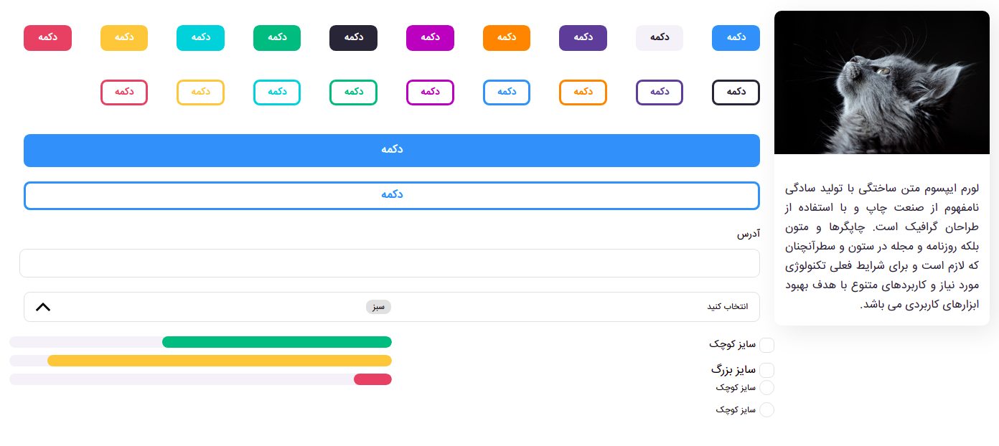

# React js design system

This project was bootstrapped with [Mohsen babaei](https://github.com/mbpmohsen).



## Usage
You can use this package like any other packages:

### `npm run build-storybook`
First you must run this command, After executing this command, it will give you a built-in version.

### `npm pack`
Now by executing this command, it will give you a *.tgz file that you can put in your project.

You can use it by adding the link of this package inside the package.json :

```json
  "dependencies": {
    "design-system": "file: ./react-design-system-0.1.0.tgz"
  },
```
Now, after executing the `npm install` or `npm install design-system` command, you can use it anywhere in the project.

Enjoy it 🙂.

## Available Scripts

In the project directory, you can run:

### `npm run storybook`

Runs the design system in the localhost.\
Open [http://localhost:6006](http://localhost:6006) to view it in the browser.

### `npm run build-storybook`

Builds the design system to the `storybook-static` folder.

### `npm test`

Launches the test runner in the interactive watch mode.\
See the section about [running tests](https://facebook.github.io/create-react-app/docs/running-tests) for more information.

### `npm run eject`

**Note: this is a one-way operation. Once you `eject`, you can’t go back!**

If you aren’t satisfied with the build tool and configuration choices, you can `eject` at any time. This command will remove the single build dependency from your project.

Instead, it will copy all the configuration files and the transitive dependencies (webpack, Babel, ESLint, etc) right into your project so you have full control over them. All of the commands except `eject` will still work, but they will point to the copied scripts so you can tweak them. At this point you’re on your own.

You don’t have to ever use `eject`. The curated feature set is suitable for small and middle deployments, and you shouldn’t feel obligated to use this feature. However we understand that this tool wouldn’t be useful if you couldn’t customize it when you are ready for it.

## Technical documents

You can use the following documents to better understand the code for developing or editing system design:<br/>
[Badge](./src/stories/Badge/Badge.md)<br/>

[Button](./src/stories/Button/Button.md)<br/>

[Card](./src/stories/Card/Card.md)<br/>

[Checkbox](./src/stories/Checkbox/Checkbox.md)<br/>

[Dropdown](./src/stories/Dropdown/Dropdown.md)<br/>

[Input](./src/stories/Input/Input.md)<br/>

[Loading](./src/stories/Loading/Loading.md)<br/>

[Progress](./src/stories/Progress/Progress.md)<br/>

[Radio](./src/stories/Radio/Radio.md)<br/>

[Table](./src/stories/Table/Table.md)<br/>